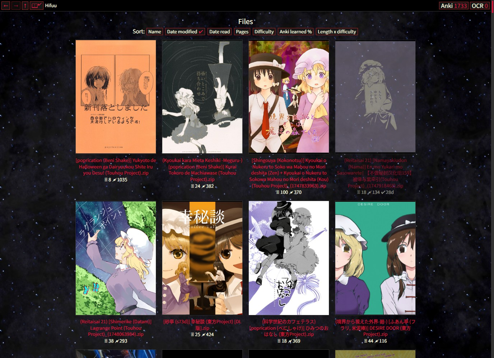

#  mokutan

An unified, opinionated web interface to OCR Japanese manga with
[mokuro](https://github.com/kha-white/mokuro/) and read with
[Yomitan](https://yomitan.wiki/).




https://github.com/user-attachments/assets/b5e2feb8-6c5f-499b-b9e6-eca54c54f454


Made as an alternative to the combination of
mokuro CLI and [Mokuro Reader](https://github.com/ZXY101/mokuro-reader),
mokutan is designed to be simple in both its implementation and daily usage:

- Just the essentials
- Zero JavaScript
- Rely on the filesystem and classic browser features as much as possible
- No dealing with command line after installation, long waiting times and
  manual importing when you're just trying to read


## Features

- Explore your filesystem directly, mokutan will render any folder
  containing images as a manga

- ZIP and CBZ are transparently supported ("folder" will also refer to those)

- Start new OCR jobs, optionally including next folders or subfolders

- Pause, cancel, or change the priority of existing OCR jobs in the queue

- Estimated difficulty calculation for every OCRed folder

- Take into account words learned in Anki for scores calculation if connected

- Mark folders as read

- Sort folders by name, length, difficulty, date read, etc.

- Start reading while it's still OCRing, refreshes immediately bring new pages

- Easy navigation: forget fighting with the UI on every page.
  Set your zoom once if the default isn't right for kanji deciphering,
  then just scroll down like any other sane web page.

- When connected to Anki, OCRed words that are part of your decks are
  highlighted according to their status (red = not learned yet, orange = young,
  green = mature, black = not in decks).
  This allows novice learners to read faster and with less frustration by
  giving hints on words for which more or less recall efforts should
  be attempted before checking Yomitan.

- Special logic to split text bubbles more aggressively.
  Example with the same panels, rendered in Mokuro Reader (left, jumbled text)
  vs mokutan (right, matches real layout):
  


## Installation

Your system needs [git](https://git-scm.com/install/),
[uv](https://docs.astral.sh/uv/getting-started/installation/), and an up to
date browser (since this program makes use of
"newish" CSS features). Note that Firefox doesn't support themed scrollbars.

In a terminal:
```sh
git clone https://github.com/xrun1/mokutan
cd mokutan
```

Then start with `uv run mokutan`.

Check `uv run mokutan --help` for supported options.

To update the program later, do `git pull` in the cloned repository folder
before running.

On Windows, the program can also be started with `.venv\Scripts\mokutan.exe`,
which gets created the first time you use the run command above.
Creating a shortcut to that executable in
`%appdata%\Microsoft\Windows\Start Menu\Programs\Startup`
will start mokutan on login automatically.


## Tips

- If you already have manga OCRed by mokuro before
  (original folder/archive + .mokuro file), just navigate there with mokutan,
  it deals with .mokuro files the same way

- You can directly paste a path after `http://localhost:2323/` in the address
  bar to point mokutan there, your browser should automatically translate
  special characters (including backslashes to slashes on Windows)

- Hovering on the difficulty scores under folder names reveals
  some more detailed information

- If you see a page you want to get another look at later while reading,
  middle clicking on the filename box above it will essentially duplicate the
  current tab with the right scroll position

- Still can't understand a sentence? Select → Right click → Translate


## Known issues

- Highlighting of words doesn't have access to Yomitan dictionaries, so
  the way things are parsed can differ with what Yomitan detects.
  See colors as hints only.

- Slow loading of folders with hundreds of manga inside: difficulty calculation
  does a lot of disk IO and number-crunching. The results are cached,
  but currently the logic isn't very smart and thus making changes to your
  decks in Anki will reset the cache.


## How do I...

### Add words to Anki

Do so from the Yomitan popup
([setup guide](https://donkuri.github.io/learn-japanese/mining/))

### Make images smaller/larger

Control the zoom with ctrl+mouse wheel or ctrl +/-.
Images can't get wider than the browser,
so if it's not enough, make your window larger.

### Mark favorites

Bookmarks

### Sync on the cloud

Don't sync on the cloud

### Sync

[FreeFileSync](https://freefilesync.org/)

Or mapped network drives on Windows, or mounted SMB shares on Linux,
mokutan can browse those just fine

### Resume reading where I left

Leave the tab open

### Resume reading where I left on another device

Use browser sync to sync your tabs

### Change visual thing I don't like

[Stylish](https://chromewebstore.google.com/detail/stylish-custom-themes-for/fjnbnpbmkenffdnngjfgmeleoegfcffe?hl=en)

#### Disable Anki word coloring

```css
.anki-new, .anki-young, .anki-mature {
    color: unset !important;
}
```

#### Dull background

```css
body {
    background: black;
}
```

### Track my reading speed

Here's your personal graph, updated every 24 hours:


(Read more)

### Something else!!

[Open an issue](https://github.com/xrun1/mokutan/issues)
